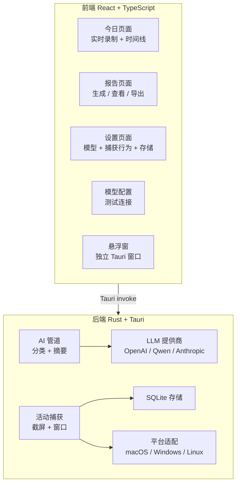

# 📋 somReport 项目改进分析报告

> **项目概述**：somReport（日报助手）是一个基于 Tauri 2 + React 19 的桌面应用，自动捕获用户的应用使用活动（截屏 + 窗口检测），通过 LLM（Qwen/OpenAI/Anthropic）进行分类和总结，生成日报/周报。

---

## 🏗️ 架构总览

---

## 🔴 已发现的 Bug

> [!CAUTION]
> 以下问题会导致运行时错误或异常行为，建议立即修复。

| # | 严重度 | 文件 | 问题描述 |
|---|--------|------|----------|
| 1 | 🔴 严重 | [Timeline.tsx](file:///Users/somnus/proj/somReport/src/components/Timeline.tsx) | **React Hooks 违规**：`useState` 和 `useMemo` 在 early return 之后调用（约 L27-35），违反 Hooks 规则，当组件从有数据切换到无数据时会产生运行时错误 |
| 2 | 🔴 严重 | [StateViews.tsx](file:///Users/somnus/proj/somReport/src/components/StateViews.tsx) | **Loading spinner 不转**：组件使用 CSS class `state-spinner`，但 `@keyframes spin` 仅绑定在 `.btn-spinner` 上，导致加载动画静止不动 |
| 3 | 🟡 中等 | [recording.ts](file:///Users/somnus/proj/somReport/src/stores/recording.ts) | **pause/stop 无错误处理**：`start()` 有 try-catch，但 `pause()` 和 `stop()` 没有，失败时产生 unhandled rejection |
| 4 | 🟡 中等 | [recording.ts](file:///Users/somnus/proj/somReport/src/stores/recording.ts) | **初始状态不同步**：`subscribe()` 只监听未来事件，不获取当前状态。如果后端已在录制，前端依然显示"已停止" |
| 5 | 🟡 中等 | [types.ts](file:///Users/somnus/proj/somReport/src/lib/types.ts) vs [constants.ts](file:///Users/somnus/proj/somReport/src/lib/constants.ts) | **分类标签冲突**：`CATEGORY_LABELS` 中 `research: '研究'`，`CATEGORIES` 中 `research: '调研'`，两处不一致 |
| 6 | 🟡 中等 | [styles.css](file:///Users/somnus/proj/somReport/src/styles.css) | **Noise overlay z-index 过高**：`.app-layout::after` 的 `z-index: 9999` 会遮挡未来添加的 Modal / Dropdown |

---

## 🟠 安全问题

| # | 文件 | 问题 | 建议 |
|---|------|------|------|
| 1 | [Reports.tsx](file:///Users/somnus/proj/somReport/src/pages/Reports.tsx) | 报告内容以 `<pre>` 渲染原始 markdown，如果改为 HTML 注入则存在 XSS 风险 | 使用 `react-markdown` 安全渲染 |
| 2 | [Settings.tsx](file:///Users/somnus/proj/somReport/src/pages/Settings.tsx) | API Key 明文显示 | 使用 `type="password"` + 显示/隐藏切换 |
| 3 | [ModelConfig.tsx](file:///Users/somnus/proj/somReport/src/pages/ModelConfig.tsx) | API Key 持久化行为不清晰 — UI 提示"不保存"但实际传给后端 | 统一行为并明确说明 |
| 4 | [tauri.conf.json](file:///Users/somnus/proj/somReport/src-tauri/tauri.conf.json) | CSP 过于宽松，允许多个外部域 | 按需收紧 |
| 5 | 后端 storage | API Key 明文存入 SQLite | 考虑使用系统密钥链或加密存储 |

---

## 🟡 功能缺失

### 前端功能

| 功能 | 现状 | 建议 |
|------|------|------|
| **Markdown 渲染** | 报告以 `<pre>` 显示原始 markdown 文本 | 集成 `react-markdown` 正确渲染 |
| **报告管理** | 无删除功能，无按类型筛选，生成后不自动选中新报告 | 添加删除、筛选、自动定位 |
| **活动详情交互** | Timeline 和 ActivityCard 删除无确认 | 添加删除确认对话框 |
| **预算对比** | `BudgetIndicator` 只显示用量数字，不与设置中的预算上限对比 | 显示进度条 + 接近上限时预警 |
| **深色/浅色主题** | 仅暗色主题，无系统主题跟随 | 添加 CSS 变量主题切换 |
| **全局错误边界** | 组件抛错直接白屏 | 添加 React Error Boundary |
| **无障碍** | 缺少 ARIA label、键盘导航、焦点管理 | 系统性添加 a11y 支持 |
| **国际化** | 中文硬编码在所有组件中 | 引入 i18n 框架 |
| **按钮防抖** | CaptureToggle、ActivityCard 的操作按钮可被连续点击 | 添加 loading/disabled 状态 |
| **数据导出增强** | 仅支持 .md 导出，`copyToClipboard` 无错误处理 | 添加 PDF 导出、剪贴板错误处理 |

### 后端功能

| 功能 | 现状 | 建议 |
|------|------|------|
| **异步报告生成** | `generate_report` 同步阻塞 Tauri 主线程 | 改为 async 命令或后台任务 |
| **空闲检测** | 用户离开时继续捕获 | 接入系统空闲事件，自动暂停 |
| **系统托盘** | 无托盘图标 | 添加托盘 + 后台运行 + 快捷操作 |
| **优雅关闭** | 关闭 app 时不清理捕获线程 | 注册 app exit 事件清理资源 |
| **Linux 支持** | [linux.rs](file:///Users/somnus/proj/somReport/src-tauri/src/platform/) 返回 "Unknown" 占位符 | 通过 X11/Wayland 实现 |
| **Embedding 管道** | 设置可配置 embedding 模型但从未使用 | 实现用于活动聚类和智能分类 |
| **日志框架** | 无 `tracing`/`log` — 问题难以排查 | 集成 `tracing` |
| **数据保留** | 活动数据无限增长 | 定期清理旧数据 |
| **开机自启** | 无 | 使用 Tauri auto-start 插件 |
| **LLM 重试/限流** | 调用失败无重试、无速率限制 | 添加指数退避重试 + 速率限制 |
| **批量分类** | 每条活动单独调用 LLM 分类 | 支持批量发送降低成本 |

---

## 🟢 代码质量改进

### 前端

| 问题 | 文件 | 建议 |
|------|------|------|
| 重复代码 | [ActivityCard.tsx](file:///Users/somnus/proj/somReport/src/components/ActivityCard.tsx), [FloatingWidget.tsx](file:///Users/somnus/proj/somReport/src/components/FloatingWidget.tsx) | `getAppIcon` 在两处重复定义，提取到 `lib/utils.ts` |
| 死代码 | [useRecording.ts](file:///Users/somnus/proj/somReport/src/hooks/useRecording.ts) | `useRecordingState()` 已定义但从未使用（Zustand store 代替了它） |
| 死代码 | [api/tauri.ts](file:///Users/somnus/proj/somReport/src/api/tauri.ts) | `clearAllData()` 已定义但未使用，被 `clearDataSelective()` 取代 |
| 类型定义分散 | [api/tauri.ts](file:///Users/somnus/proj/somReport/src/api/tauri.ts) | `StorageSizeInfo` 和 `TestResult` 定义在 API 文件中而非 `types.ts` |
| 巨型 CSS | [styles.css](file:///Users/somnus/proj/somReport/src/styles.css) (1673 行) | 拆分为 CSS Modules 或按组件组织 |
| 行内样式 | [Settings.tsx](file:///Users/somnus/proj/somReport/src/pages/Settings.tsx) L354, L356 | 使用 CSS class 替代 |
| 缓存不同步 | [recording.ts](file:///Users/somnus/proj/somReport/src/stores/recording.ts) | 新活动仅 invalidate `['today']`，不 invalidate `['dailyUsage']`，导致用量数据过时 |
| 悬浮窗架构 | [FloatingWidget.tsx](file:///Users/somnus/proj/somReport/src/components/FloatingWidget.tsx) | 独立管理状态和事件，不与主窗口共享 React Query / Zustand 缓存 |
| 事件竞态 | [api/tauri.ts](file:///Users/somnus/proj/somReport/src/api/tauri.ts) | `listen()` 返回 Promise 但封装为同步返回，卸载时存在竞态条件 |
| `PeriodType` | [types.ts](file:///Users/somnus/proj/somReport/src/lib/types.ts) | 定义了 `'custom'` 类型但 UI 未使用 |

### 后端

| 问题 | 文件 | 建议 |
|------|------|------|
| 错误类型 | 全局 | 全部使用 `String` 作为错误，应引入 `thiserror` 定义结构化错误 |
| DB 连接 | [storage/](file:///Users/somnus/proj/somReport/src-tauri/src/storage/) | 每次操作新建连接，应使用 `r2d2` 连接池 |
| HTTP 客户端 | [providers/](file:///Users/somnus/proj/somReport/src-tauri/src/providers/) | 每次请求新建 `reqwest::Client`，应复用 |
| DB 索引 | [migrations/](file:///Users/somnus/proj/somReport/src-tauri/src/migrations/) | `activities.started_at` 和 `reports.date` 缺少索引 |
| 初始化 panic | [lib.rs](file:///Users/somnus/proj/somReport/src-tauri/src/lib.rs) | 部分初始化使用 `unwrap()`，应改为 `expect()` 或优雅处理 |
| 迁移系统 | [migrations/](file:///Users/somnus/proj/somReport/src-tauri/src/migrations/) | 无版本追踪表，无回滚支持 |
| 捕获间隔硬编码 | [capture/](file:///Users/somnus/proj/somReport/src-tauri/src/capture/) | 30秒间隔硬编码，不读取设置中的 `captureInterval` |
| 平台代码 | [platform/macos.rs](file:///Users/somnus/proj/somReport/src-tauri/src/platform/) | 无 macOS 辅助功能权限检测，可能静默失败 |

---

## 📋 建议改进路线图

### Phase 1 — 修 Bug + 安全加固 🔴
> 预计工作量：1-2 天

1. ✏️ **修复 Timeline.tsx Hooks 违规** — 将 Hooks 移到 early return 之前
2. ✏️ **修复 spinner 动画** — 将 `spin` keyframe 绑定到 `.state-spinner`
3. ✏️ **修复 pause/stop 错误处理** — 添加 try-catch
4. ✏️ **修复分类标签不一致** — 统一 `types.ts` 和 `constants.ts`
5. ✏️ **降低 noise overlay z-index** — 避免遮挡未来的 Modal
6. 🔐 **API Key 遮罩显示** — input type="password"
7. 🔐 **集成 react-markdown** — 替代原始文本/HTML 渲染
8. ⚡ **generate_report 改为 async** — 避免阻塞主线程

### Phase 2 — 核心体验提升 🟡
> 预计工作量：3-5 天

9. 🖥️ **系统托盘** — 后台运行 + 录制状态 + 快捷操作
10. 🔄 **初始录制状态同步** — subscribe 时获取当前后端状态
11. 🗑️ **报告删除 + 活动删除确认** — 防止误操作
12. 📊 **预算进度条** — 与设置中的上限对比显示
13. 🔔 **Toast 通知** — 替代 console.error
14. 🏗️ **添加 Error Boundary** — 防止白屏
15. 📦 **DB 索引 + 连接池** — 提升查询性能
16. 🧹 **清理死代码** — `useRecordingState`、`clearAllData`、重复 `getAppIcon`
17. 📋 **dailyUsage 缓存 invalidation** — 新活动时刷新用量

### Phase 3 — 体验优化 🟢
> 预计工作量：3-5 天

18. 🌗 **浅色/深色主题切换** — CSS 变量 + 系统跟随
19. 🖱️ **Timeline 交互增强** — 活动详情、排序、空闲可视化
20. 📤 **报告导出增强** — PDF + 改进剪贴板处理
21. ⏰ **定时提醒** — 下班前生成日报通知
22. 🎨 **CSS 重构** — CSS Modules + 设计 token
23. ♿ **无障碍支持** — ARIA labels + 键盘导航
24. 🔘 **按钮防抖** — loading/disabled 状态
25. 🪵 **集成 tracing 日志** — 结构化日志记录
26. ⚠️ **macOS 权限检测** — 提示用户授予辅助功能权限

### Phase 4 — 进阶功能 🔵
> 预计工作量：5-10 天

27. 🧠 **Embedding 管道** — 活动聚类 + 智能分类
28. 📦 **LLM 批处理 + 重试** — 降低成本 + 提高可靠性
29. 🗄️ **数据保留策略** — 自动清理 + 数据库备份
30. 🚀 **开机自启** — Tauri auto-start 插件
31. 📝 **多报告模板** — standup / 详细 / 周报 / 自定义
32. 🐧 **Linux 平台支持** — X11/Wayland 窗口检测
33. 🌐 **国际化** — i18n 框架支持多语言
34. 🪟 **多窗口架构** — 悬浮窗与主窗口共享状态

---

> [!TIP]
> 建议从 **Phase 1** 开始，这些是影响应用稳定性和安全性的基础问题。告诉我你想先做哪些改进，我可以立即开始实现！
